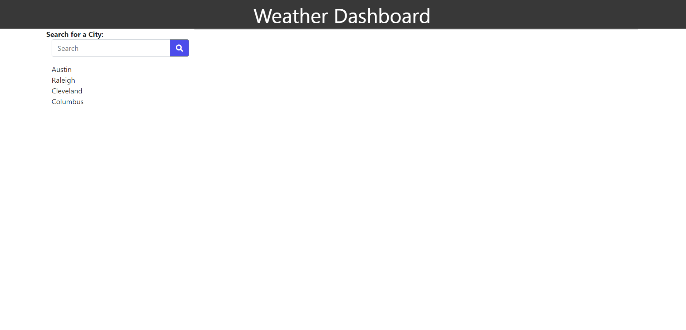
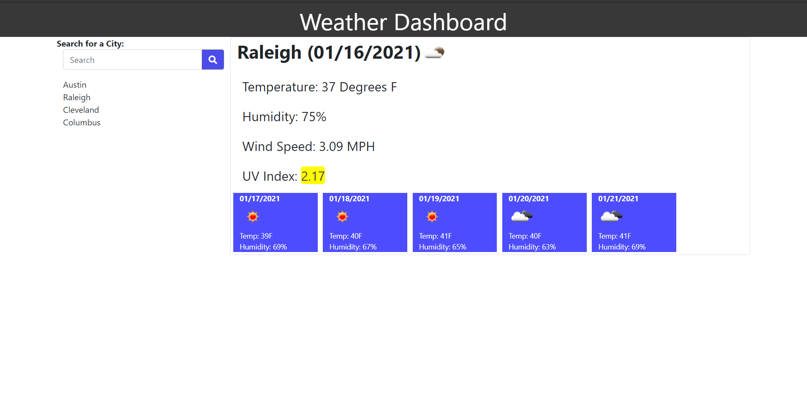

# Weather Dashboard

The weather dashboard is a website that lets you find the current weather and five day forcast for a searched city. It will also save the recently saved cities so that you can look back at cities that you searched.

<a href = "https://chrisrisseler.github.io/weather_dashboard/">Here is a link to the weather dashboard.</a>

## Using Weather Dashboard

To use the weather dashboard, you need to enter a city name into the search box and click the search button. This will display the current weather to the right, and below it a five day forcast for this city. After you search, the city you searched will be displayed below the search box. If you click on the name below the search box, it will search for that name automatically.

  

## Contributors

Thanks to the following people who have contributed to this project:

* Chris R.
* Alper G.
* Carl V.
* Joshua B.
* Tim A.
* Alistair R.
* Luke B.
* Steven I.

## Contact

If you want to contact me you can reach me at chrisrisseler43@gmail.com.

## License
<!--- If you're not sure which open license to use see https://choosealicense.com/--->

This project uses the following license: MIT Liscence Copywright (c) 2021 Chris Risseler <a href = "assets/license.md">License Here.</a>